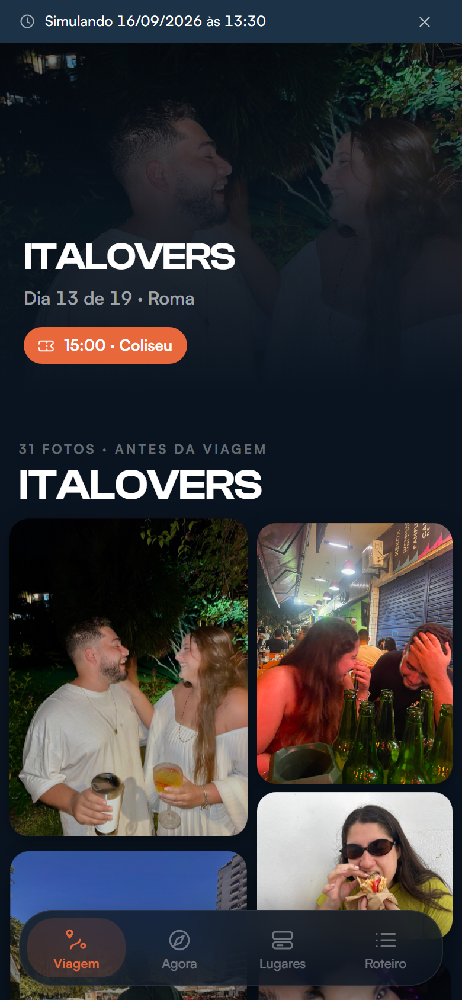
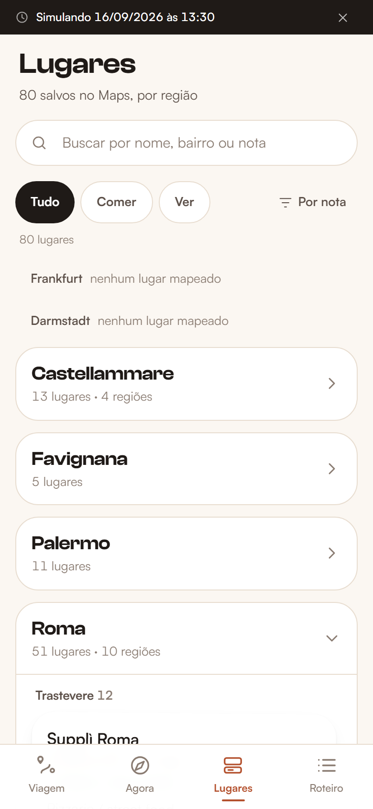

# Italovers

**[italovers.vercel.app](https://italovers.vercel.app)** — instalável como app no iPhone e no
Android. A localização só funciona sob HTTPS: o iOS Safari se recusa a dar posição em `http://`.

PWA mobile-first que cruza os lugares que a gente salvou no Google Maps com o roteiro
da viagem e o GPS do celular. Tudo pendurado numa linha do tempo geográfica: a viagem é
uma linha só, do Rio ao Rio, e cada aba é uma pergunta diferente sobre ela.

> **Viagem** — por onde a gente passa?
> **Agora** — estou parado aqui: o que salvamos por perto, e qual era o plano de hoje?
> **Lugares** — o que a gente salvou, afinal?
> **Roteiro** — o que está marcado, capítulo por capítulo?

Ferramenta pessoal, feita pra uma viagem de 19 dias por Alemanha, Sicília, Roma e Munique
em setembro de 2026. Dois usuários: eu e minha namorada.

| Viagem | Agora |
|---|---|
|  |  |

| Lugares | Roteiro |
|---|---|
|  |  |

## O problema

Eu já tinha duas coisas prontas e desconectadas: **83 lugares** marcados no Google Maps com
anotações nossas, e um roteiro dia a dia. Na rua, nenhuma das duas serve: o Maps não sabe
qual era o plano de hoje, e o roteiro não sabe onde eu estou.

O app é a junção das duas com a posição do GPS. Todo o resto é secundário.

*(Dos 83, o app navega **80**: os outros 3 são endereços das nossas hospedagens, que
aparecem no mapa como hotel mas nunca em lista de sugestão.)*

## Decisões que moldaram o projeto

**Custo zero, sem cartão em lugar nenhum.** Isso elimina a API JS do Google Maps e o
Mapbox. Mapa é **Leaflet + tiles do CARTO** (dados do OpenStreetMap), geolocalização é a `navigator.geolocation`
nativa, e a distância é Haversine escrito à mão — não vale uma dependência por 15 linhas.

**O catálogo é JSON estático no repositório.** Os 83 lugares e o roteiro não mudam durante
a viagem, então não têm por que estar num banco: mudá-los é um commit.

**O estado do casal, esse sim, sincroniza — e essa decisão foi revertida no meio.** O
projeto nasceu sem backend, com tudo no `localStorage`. Só que somos dois: o que um marca
como visitado nunca chegava no outro, e a aba Notas, que existe pra ser a avaliação *dos
dois*, jamais via as duas opiniões juntas. Entrou **Supabase** (Postgres + Auth + Realtime,
plano grátis) guardando visitados, notas e decisões de roteiro.

**Mas o `localStorage` continua sendo a fonte imediata da verdade**, e o login é opcional.
Escrita grava local na hora e entra numa fila que esvazia quando há rede; deslogado, o app
funciona exatamente como antes. Sem isso, marcar um restaurante sem sinal não funcionaria —
pior que o problema original. O convite pra entrar fica dentro da aba Notas, nunca na
porta: o app precisa abrir no avião.

**Detecção de fase por GPS, não só por data.** A viagem tem vários dias de deslocamento em
que a data mente: dia 12/09 o calendário diz "Palermo", mas às 07:00 a gente ainda está em
Favignana esperando a balsa; o dia 14/09 casa com duas fases ao mesmo tempo. Quando a data
é ambígua **ou** o GPS diz que estamos a mais de 50 km do centro da fase que a data indica,
o GPS ganha. E a fase ativa é sempre visível, com override manual — errar em silêncio, sem
saída, é pior que errar.

**O problema de Terni.** Na fase de Roma a gente dorme em Terni, mas os 51 lugares mapeados
estão em Roma, a ~100 km. Então "por perto" volta vazio toda noite e toda manhã,
legitimamente. Lista vazia não serve pra nada: nesse caso o app mostra o plano de amanhã e
os melhores lugares da região. A mesma tela cobre três situações diferentes, que são
diferentes de propósito:

- `phase-empty` — a fase não tem nenhum lugar mapeado (Alemanha, Munique)
- `far` — tem GPS e não há nada num raio útil (Terni)
- `no-gps` — sem posição. Aqui o app **não** pode dizer "você está longe de tudo": ele
  simplesmente não sabe onde você está

**Split Comer / Ver.** 46 dos 83 lugares são restaurante. Numa lista única, todo ponto
turístico fica soterrado sob uma parede de trattorias.

**A rota é desenhada em arcos, não em retas.** Frankfurt é o centro de duas fases (ida e
volta) e Darmstadt de outras duas, então Rio→Frankfurt e Frankfurt→Rio ligam exatamente o
mesmo par de pontos: em linha reta, a volta fica escondida embaixo da ida. Cada trecho
arqueia sempre para a esquerda do sentido de viagem, e as duas curvam para lados opostos.

O mesmo problema volta nos pinos, e pior: além dos pares exatos, Frankfurt e Darmstadt
ficam a 19 km uma da outra — no zoom que mostra Alemanha até Sicília, isso dá 5 pixels, e
os quatro pinos viravam uma mancha. Então o agrupamento é por proximidade **projetada em
tela**, refeito a cada `zoomend`, e o leque é vertical porque o rótulo sai pela direita.

**O enquadramento exclui o Rio.** Incluir põe o Atlântico inteiro na tela e a Europa — que
é a viagem de verdade — vira um aglomerado no canto. Os arcos transatlânticos continuam
desenhados e saem pela borda, o que já conta "viemos de longe" sem gastar a tela com oceano.

**Roma precisou de um nível a mais de agrupamento.** 51 dos 80 lugares navegáveis estão
lá, e uma lista de 51 não se lê. Cada lugar carrega um `sublocal` derivado por script e
gravado no JSON, que quebra Roma em 10 bairros — Trastevere 12, Centro Storico 11, Trevi 9,
e por aí.

Os dois atalhos óbvios erram, e eu medi antes de escolher. **CEP não serve**: `00153` cobre
Trastevere *e* Testaccio, lados opostos do rio. **Longitude não serve**: inverte o `Mordi &
Vai` (é Testaccio, parece Trastevere) com a `Trattoria Da Teo` (é Trastevere, parece
Testaccio). O que serve é haversine até centros de distrito definidos à mão. Palermo e
Favignana ficam num grupo só — 11 e 5 lugares não justificam fronteira arbitrária.

**As anotações pessoais são o texto herói do card**, em manuscrita, acima da nota do Google.
Elas são informais e às vezes caóticas ("tiramisu parece insanoooooo") e ficam exatamente
como foram escritas — a voz é o ponto. A nota do Google é secundária, e nem estrela colorida
ganha: ela não disputa com a nota pessoal.

## Stack

| Camada | Escolha |
|---|---|
| Framework | React 19 + Vite 8 |
| Estilo | Tailwind CSS 4 |
| Mapa | Leaflet + tiles escuros do CARTO (dados OpenStreetMap) |
| PWA | vite-plugin-pwa (manifest + service worker) |
| Sincronização | Supabase (Postgres + Auth + Realtime), plano grátis |
| Geocoding | Nominatim (OSM), via script one-off |
| Tipografia | Clash Display nos títulos, Satoshi na interface, Caveat nas notas — todas variáveis e auto-hospedadas |
| Movimento | Framer Motion + scroll-driven animations nativas |
| Testes | Vitest + Testing Library — 251 testes |
| Lint | Oxlint |

## Rodando

```bash
npm install
npm run dev
```

| Script | O que faz |
|---|---|
| `npm run dev` | servidor de desenvolvimento |
| `npm test` | 251 testes (lógica pura em node, render em jsdom) |
| `npm run build` | verifica que não há dado sensível e builda |
| `npm run lint` | Oxlint |
| `npm run geocode` | geocodifica lugares e hotéis sem coordenada via Nominatim |
| `npm run sublocal` | deriva o bairro de cada lugar e normaliza `city_raw` |
| `npm run fonts` | baixa e vendoriza as três fontes em `public/fonts/` |
| `npm run gallery` | mede a proporção das 31 fotos da galeria |
| `npm run photos` | baixa as fotos dos lugares do Wikimedia Commons |
| `npm run hours` | busca horário de funcionamento no OpenStreetMap (retomável) |
| `npm run icons` | gera os ícones do PWA a partir do SVG |
| `npm run strip-secrets` | move os campos sensíveis do itinerário pra um arquivo local |

### Parâmetros de URL, pra testar

A viagem é em setembro de 2026, então sem simular data não há nada pra ver:

```
?d=2026-09-16&t=13:30   simula data e hora (mostra uma tarja avisando)
?d=off                  desliga a simulação
?tab=lugares            abre direto numa aba: viagem, agora, lugares, roteiro ou notas
```

E pra tirar print com viewport de celular de verdade (o `--window-size` do Chrome headless
tem largura mínima no Windows, então não chega a 390px — isso usa CDP):

```bash
node scripts/shot.mjs "http://localhost:5173/?tab=agora&d=2026-09-16&t=13:30" \
  saida.png 390 844 --gps=41.8902,12.4922
```

O script também mede overflow horizontal e aponta os elementos culpados, que é o defeito
que só aparece em tela estreita.

## Dados

Dois arquivos em `src/data/`:

- **`places.json`** — 83 lugares com categoria, fase, **bairro (`sublocal`)**, coordenada,
  nota pessoal, nota e contagem de avaliações do Google, faixa de preço e link do Maps
- **`itinerary.json`** — 9 fases (com `country` e `short`), 19 dias com blocos tipados
  (`transport`, `flight`, `ferry`, `hotel`, `activity`, `food`, `decision`), 4 hospedagens,
  voos e balsas

Detalhes que viraram código:

- Blocos `booked: true` são horários pagos e imóveis (Coliseu, Fórum, Museus do Vaticano).
  O app avisa quando um deles está a menos de 3 horas — perder um ingresso pré-pago dói.
- Blocos `dynamic: true` não têm conteúdo fixo: são os espaços onde o app injeta os 3
  lugares mais próximos ainda não visitados, em vez de renderizar texto placeholder.
- Blocos `decision` são os dias em que ainda há escolha a fazer; a opção escolhida persiste,
  e o aviso dela aparece quando é o caso (escolher o "Cenário B" em Roma mata a Audiência
  Papal da manhã seguinte).
- O bloco com `phase_id_override` é único no arquivo, e é o que faz o **14/09 aparecer em
  dois capítulos**. No dado ele é uma data só — e está certo, é uma data só de calendário,
  que o roteiro original chamava de "DIA 7" e "DIA 8". Mas metade dele acontece em Palermo
  e a outra metade em Roma, então os capítulos o fatiam no pouso das 18:55: manhã e tarde
  num, noite no outro. Os 19 dias rendem 20 segmentos.

### A galeria, e por que ela não é do roteiro

31 fotos nossas de **antes** da viagem. Elas não pertencem a fase nenhuma e não são
distribuídas pelo itinerário — são de casa, do Rio, de antes. Vivem numa seção própria.

Colagem em duas colunas de larguras diferentes, e a repartição equilibra **altura**, não
contagem: com 24 retratos (3:4) e 7 paisagens (4:3) misturados, alternar par/ímpar deixaria
uma coluna vários centímetros mais alta. Cada foto entra na coluna mais curta no momento —
e como a largura entra na conta, a coluna larga acaba com *menos* fotos (14 contra 17),
porque cada uma ocupa mais espaço vertical nela.

Nenhuma foto é recortada. Não existe foto quadrada no acervo, então o ciclo de alturas que
a spec pedia exigiria cortar 3:4 para quadrado — o que, em foto de casal, corta cabeça ou pé.

**São 7,1 MB e o CDN não tem thumbnail** (testei `?w=`, `?width=`, `?resize=`, `?tr=`: todos
devolvem o original). Por isso o `loading="lazy"` e o `content-visibility` não são
otimização, são o que impede a aba de puxar 7 MB de uma vez no 4G italiano. As proporções vão
medidas no `gallery.json` pelo `npm run gallery`, que lê só o marcador SOF do JPEG em vez de
baixar cada arquivo inteiro — sem medida gravada, cada foto que chega empurraria a coluna
para baixo, e é justamente a posição do elemento que o parallax está lendo.

### Espaço reservado para fotos

Quatro campos opcionais existem no formato e estão **ausentes em 100% dos dados**, à espera
das URLs: `trip.hero_photo`, `phases[].cover_photo`, `days[].photos[]` e `places[].photos[]`.

O componente `<Photo>` já nasce com lazy loading, skeleton e `onError` caindo no fallback —
o caso que ele precisa acertar não é a imagem carregando, é a ausência. Capa de fase sem
foto vira gradiente do accent com o número do capítulo em marca d'água, e a proporção 16:9
fica reservada para preencher as URLs depois não empurrar a página. Em lugar nenhum aparece
ícone de imagem quebrada.

### Tipografia

Três papéis, três fontes. **Clash Display** só em título de tela e cabeçalho de capítulo,
**Satoshi** em toda a interface, **Caveat** exclusivamente na nota pessoal. O contraste
entre a grotesca e a manuscrita é o que faz a nota parecer escrita por gente, e não um
campo de banco de dados.

A Caveat é o ponto do redesenho. Ela sobe para 22px porque corre pequena: precisava empatar
em tamanho com o nome do lugar para ganhar dele em presença. A nota é o texto herói do card;
o nome é só a etiqueta.

As três são **auto-hospedadas, não puxadas de CDN**: o app é PWA e precisa abrir sem sinal,
e um `@import` de terceiro quebra o offline e entra no caminho crítico do primeiro paint.
São 144 KB no precache (a Caveat sozinha é 73 KB — manuscrita tem curva demais), contra
37 KB da Montserrat que saiu. Caro, mas é custo único e a viagem inteira roda offline.

Só Satoshi e Clash têm `preload`: os 73 KB da Caveat disputariam banda com o bundle para
atender um campo só. Na primeira carga a nota pisca uma vez; da segunda em diante o service
worker já tem tudo.

Um detalhe que sobreviveu à troca: o intervalo de horário do roteiro fica empilhado (início
em cima, fim embaixo) em vez de `08:30–09:00` numa linha. São 11 caracteres numa coluna de
56px — não cabe em fonte nenhuma, e alargar a coluna roubaria espaço do título.

### Tema escuro

A paleta era creme com terracota. Bonita, e exatamente por isso o problema: é a saída
default mais comum de LLM, e o app inteiro parecia gerado. Agora é navy escuro, e os tokens
passaram a ser nomeados **por papel** (`surface`, `line`, `fg-dim`) e não por cor —
`sand-200` só dizia alguma coisa para quem soubesse que sand era o bege.

Isso pagou um dividendo concreto: o bottom sheet é branco sobre o escuro, e em vez de dar
variante clara a cada componente, um único bloco CSS redefine os tokens naquele escopo.
Como `bg-surface` compila para `var(--color-surface)`, a subárvore inteira vira clara — o
`PlaceCard` lá dentro nasce no tema certo sem saber que existe tema claro.

O accent clareou de `#B4522F` para `#E8683C`: o antigo foi escolhido para contrastar com
creme e fica lamacento sobre navy.

### Acento com parcimônia

`#B4522F` aparece só em CTA, estado ativo e trecho percorrido da rota. Ele saiu do rótulo de
categoria, que virou um ponto colorido (mantendo o pareamento com os pinos do mapa sem
gastar o accent em informação secundária), e saiu da estrela do rating.

### Horários: só o que o OpenStreetMap sabe

Na Itália a regra é o *riposo settimanale* — quase todo restaurante fecha um dia da semana,
e muitos fecham entre o almoço e o jantar. Sugerir um lugar fechado gasta a caminhada, então
o card mostra "Aberto · fecha 23:00", "Fechado hoje · abre quarta" ou "Fechado · abre em 30
min".

Os horários vêm do OSM, casados **por nome exato** — mesma disciplina das fotos. Pegar "o POI
mais próximo que tem horário" encheria a base com o horário da loja do lado. Cobertura real:
**24 dos 82** lugares com coordenada. Quem não tem fica sem, e o card não diz nada a respeito:
"horário desconhecido" não ajuda ninguém a decidir se vale a caminhada.

O parser de `opening_hours` (`src/lib/hours.js`) é escrito à mão e cobre só a gramática que
os dados usam. A spec completa tem feriado, "último domingo do mês" e nascer do sol — existe
biblioteca pra isso, mas ela pesa mais que toda a lógica do app. **Regra que o parser não
entende vira texto cru na tela, sem afirmar aberto ou fechado**: dizer "aberto" errado te faz
andar até uma porta fechada, e é o único erro que essa tela não pode cometer.

### Fotos: por que só 13 dos 83 lugares têm

Medi as fontes gratuitas antes de escolher, e o resultado decidiu o escopo. Busca automática
por nome é inutilizável: no Wikidata, "Coliseu" devolve `ColiseumBarcelona.jpg`, "Panteão"
devolve o Mausoléu de Augusto, e o restaurante **Formica** devolve uma *formiga*
(`Formica rufa`). Busca por coordenada devolve "foto tirada perto", não "foto do lugar" — num
quarteirão de Roma, uma igreja qualquer.

Então a tabela em `scripts/fetch-photos.mjs` é **curada à mão**, um lugar por vez, e cada
foto foi conferida no olho antes de entrar. Mesma lógica da lista `NEVER_GEOCODE`: onde a
automação erra caro, curadoria é o método.

Os 46 restaurantes e os outros 21 lugares de comer **não têm foto**, e isso é deliberado.
Não existe imagem deles em fonte livre — quem tem é o Google Places, que é pago e proíbe
armazenar as fotos. A alternativa seria foto genérica de banco de imagens, o que faria o card
mentir sobre o lugar: chegar na rua esperando o prato de outra pessoa em outra cidade
atrapalha mais do que ajuda. Card sem foto também não ganha placeholder cinza — ausência não
deve virar ruído visual.

Créditos em [CREDITS.md](CREDITS.md). Quase tudo é CC BY-SA, que exige autor e licença
visíveis: aparecem na folha de detalhe de cada lugar, e há teste garantindo que não somem.

### O bug da rua homônima

Vale registrar, porque é o tipo de erro que passa batido. O Google exportou o lugar `p008`
("Via Nicotera, 24/1") com coordenadas em **Roma**, bairro Prati. Só que esse endereço é o
nosso hotel em **Favignana** — existe uma Via Nicotera nas duas cidades, e o geocoder
escolheu a errada, a 500 km do lugar certo.

A correção foi manual, e a defesa virou permanente: o script de geocoding **rejeita e loga**
qualquer resultado a mais de 50 km do centro da fase daquele lugar, em vez de gravar. Tem
teste de regressão pra isso, e o `p008` está numa lista de "nunca geocodificar".

## Privacidade

O itinerário real tinha PIN de hotel, códigos de confirmação e final de cartão. Como o site
publicado é servido pra qualquer um que tenha a URL, esses campos **não entram no bundle**:
o `scripts/strip-secrets.mjs` os move pra um arquivo local fora do Git, e o `npm run build`
falha se algum deles reaparecer — inclusive por uma trava que procura os valores literais,
não só os nomes dos campos.

O backend não muda isso. A chave que vai no cliente é a **publicável**, feita pra ficar
exposta; quem protege os dados é a RLS, que só aceita e-mail presente na tabela `membros`.
Anônimo lendo as tabelas recebe lista vazia, e escrevendo recebe `42501`. Os e-mails de
login (`@italovers.app`) são fictícios — servem só de identificador, não existem.

## Rodando em outra máquina

O `.env.local` com as chaves do Supabase não está no repositório e nunca vai estar. Copie o
`.env.example` e preencha, ou puxe direto da Vercel:

```bash
npx vercel link && npx vercel env pull .env.local
```

Sem esse arquivo o app roda normalmente — `src/lib/supabase.js` exporta `null` e tudo cai
no modo local. É por isso que a suíte de testes passa sem rede.

## Limitações assumidas

- **O mapa não funciona offline.** Os tiles do OSM vêm da rede. O shell do app e os dois
  JSON ficam em cache, então o roteiro abre sem sinal e o mapa degrada. Tile offline de
  verdade estava fora de escopo.
- **A sincronização depende de login.** Deslogado, "visitado" e as notas ficam só no
  aparelho — o que é proposital, porque o app tem que abrir sem sinal e sem conta. Quem
  não entrar não vê o que o outro marcou.
- **O projeto grátis do Supabase hiberna** depois de ~1 semana sem uso e leva alguns
  segundos pra acordar. Durante a viagem não acontece; entre uma viagem e outra, sim.
- **O Nominatim é menos preciso que o Google** em viela de centro storico. Os pinos foram
  conferidos no olho depois de geocodificar.
