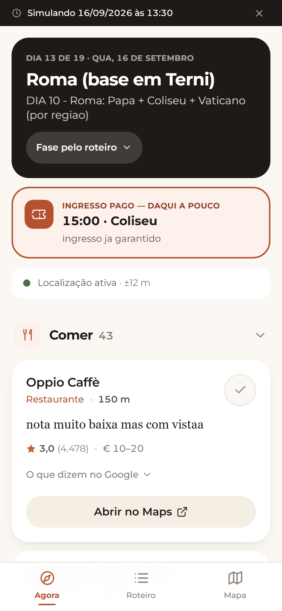
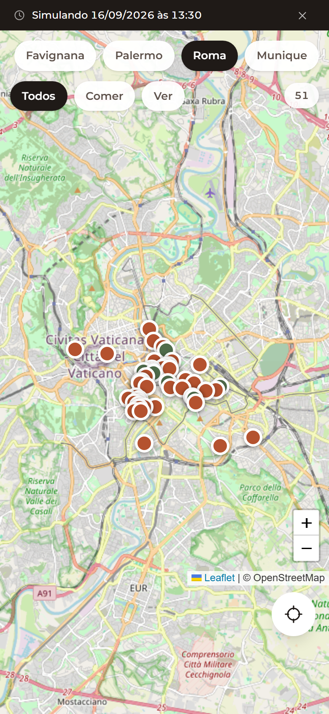

# Italovers

PWA mobile-first que cruza os lugares que a gente salvou no Google Maps com o roteiro
da viagem e o GPS do celular, pra responder bem uma única pergunta:

> **"Estou parado aqui agora — o que a gente salvou por perto, e qual era o plano de hoje?"**

Ferramenta pessoal, feita pra uma viagem de 19 dias por Alemanha, Sicília, Roma e Munique
em setembro de 2026. Dois usuários: eu e minha namorada.

| Agora | Mapa |
|---|---|
|  |  |

## O problema

Eu já tinha duas coisas prontas e desconectadas: **83 lugares** marcados no Google Maps com
anotações nossas, e um roteiro dia a dia. Na rua, nenhuma das duas serve: o Maps não sabe
qual era o plano de hoje, e o roteiro não sabe onde eu estou.

O app é a junção das duas com a posição do GPS. Todo o resto é secundário.

## Decisões que moldaram o projeto

**Custo zero, sem cartão em lugar nenhum.** Isso elimina a API JS do Google Maps e o
Mapbox. Mapa é **Leaflet + tiles do OpenStreetMap**, geolocalização é a `navigator.geolocation`
nativa, e a distância é Haversine escrito à mão — não vale uma dependência por 15 linhas.

**Sem backend, sem banco, sem login.** Os dados são JSON estático no repositório. O que
precisa persistir (lugares visitados, escolhas de roteiro) vive no `localStorage`.

**Detecção de fase por GPS, não só por data.** A viagem tem vários dias de deslocamento em
que a data mente: dia 12/09 o calendário diz "Palermo", mas às 07:00 a gente ainda está em
Favignana esperando a balsa; o dia 14/09 casa com duas fases ao mesmo tempo. Quando a data
é ambígua **ou** o GPS diz que estamos a mais de 50 km do centro da fase que a data indica,
o GPS ganha. E a fase ativa é sempre visível, com override manual — errar em silêncio, sem
saída, é pior que errar.

**O problema de Terni.** Na fase de Roma a gente dorme em Terni, mas os 51 lugares mapeados
estão em Roma, a ~100 km. Então "por perto" volta vazio toda noite e toda manhã,
legitimamente. Lista vazia não serve pra nada: nesse caso o app mostra o plano de amanhã e
os melhores lugares da região. A mesma tela cobre três situações diferentes, que são
diferentes de propósito:

- `phase-empty` — a fase não tem nenhum lugar mapeado (Alemanha, Munique)
- `far` — tem GPS e não há nada num raio útil (Terni)
- `no-gps` — sem posição. Aqui o app **não** pode dizer "você está longe de tudo": ele
  simplesmente não sabe onde você está

**Split Comer / Ver.** 46 dos 83 lugares são restaurante. Numa lista única, todo ponto
turístico fica soterrado sob uma parede de trattorias.

**As anotações pessoais são o texto herói do card**, em serifa, acima da nota do Google.
Elas são informais e às vezes caóticas ("tiramisu parece insanoooooo") e ficam exatamente
como foram escritas — a voz é o ponto. A nota do Google é secundária.

## Stack

| Camada | Escolha |
|---|---|
| Framework | React 19 + Vite 8 |
| Estilo | Tailwind CSS 4 |
| Mapa | Leaflet + tiles do OpenStreetMap |
| PWA | vite-plugin-pwa (manifest + service worker) |
| Geocoding | Nominatim (OSM), via script one-off |
| Tipografia | Montserrat (variável, auto-hospedada) + Georgia nas notas pessoais |
| Testes | Vitest + Testing Library — 104 testes |
| Lint | Oxlint |

## Rodando

```bash
npm install
npm run dev
```

| Script | O que faz |
|---|---|
| `npm run dev` | servidor de desenvolvimento |
| `npm test` | 96 testes (lógica pura em node, render em jsdom) |
| `npm run build` | verifica que não há dado sensível e builda |
| `npm run lint` | Oxlint |
| `npm run geocode` | geocodifica lugares e hotéis sem coordenada via Nominatim |
| `npm run photos` | baixa as fotos dos lugares do Wikimedia Commons |
| `npm run hours` | busca horário de funcionamento no OpenStreetMap (retomável) |
| `npm run icons` | gera os ícones do PWA a partir do SVG |
| `npm run strip-secrets` | move os campos sensíveis do itinerário pra um arquivo local |

### Parâmetros de URL, pra testar

A viagem é em setembro de 2026, então sem simular data não há nada pra ver:

```
?d=2026-09-16&t=13:30   simula data e hora (mostra uma tarja avisando)
?d=off                  desliga a simulação
?tab=roteiro            abre direto numa aba
```

E pra tirar print com viewport de celular de verdade (o `--window-size` do Chrome headless
tem largura mínima no Windows, então não chega a 390px — isso usa CDP):

```bash
node scripts/shot.mjs "http://localhost:5173/?tab=agora&d=2026-09-16&t=13:30" \
  saida.png 390 844 --gps=41.8902,12.4922
```

O script também mede overflow horizontal e aponta os elementos culpados, que é o defeito
que só aparece em tela estreita.

## Dados

Dois arquivos em `src/data/`:

- **`places.json`** — 83 lugares com categoria, fase, coordenada, nota pessoal, nota e
  contagem de avaliações do Google, faixa de preço e link do Maps
- **`itinerary.json`** — 9 fases, 19 dias com blocos tipados (`transport`, `flight`,
  `ferry`, `hotel`, `activity`, `food`, `decision`), 4 hospedagens, voos e balsas

Detalhes que viraram código:

- Blocos `booked: true` são horários pagos e imóveis (Coliseu, Fórum, Museus do Vaticano).
  O app avisa quando um deles está a menos de 3 horas — perder um ingresso pré-pago dói.
- Blocos `dynamic: true` não têm conteúdo fixo: são os espaços onde o app injeta os 3
  lugares mais próximos ainda não visitados, em vez de renderizar texto placeholder.
- Blocos `decision` são os dias em que ainda há escolha a fazer; a opção escolhida persiste,
  e o aviso dela aparece quando é o caso (escolher o "Cenário B" em Roma mata a Audiência
  Papal da manhã seguinte).

### Tipografia

Montserrat na interface, Georgia nas notas pessoais. O contraste entre a geométrica e a
serifa é o que faz a nota parecer escrita por gente, e não um campo de banco de dados.

A fonte é **auto-hospedada, não puxada do Google Fonts**: o app é PWA e precisa abrir sem
sinal, e um `@import` de CDN quebra o offline e adiciona dependência de terceiro. Só o
subconjunto `latin` é embarcado (37 KB, arquivo variável cobrindo 100–900) — português,
italiano e alemão cabem nele, e cirílico e vietnamita seriam peso morto no precache.

Montserrat é mais larga que a fonte de sistema, o que exigiu dois ajustes: tracking negativo
nos títulos, que ficavam frouxos em negrito grande, e o intervalo de horário do roteiro
empilhado (início em cima, fim embaixo) em vez de `08:30–09:00` numa linha, que quebrava
sozinho na coluna estreita.

### Horários: só o que o OpenStreetMap sabe

Na Itália a regra é o *riposo settimanale* — quase todo restaurante fecha um dia da semana,
e muitos fecham entre o almoço e o jantar. Sugerir um lugar fechado gasta a caminhada, então
o card mostra "Aberto · fecha 23:00", "Fechado hoje · abre quarta" ou "Fechado · abre em 30
min".

Os horários vêm do OSM, casados **por nome exato** — mesma disciplina das fotos. Pegar "o POI
mais próximo que tem horário" encheria a base com o horário da loja do lado. Cobertura real:
**24 dos 82** lugares com coordenada. Quem não tem fica sem, e o card não diz nada a respeito:
"horário desconhecido" não ajuda ninguém a decidir se vale a caminhada.

O parser de `opening_hours` (`src/lib/hours.js`) é escrito à mão e cobre só a gramática que
os dados usam. A spec completa tem feriado, "último domingo do mês" e nascer do sol — existe
biblioteca pra isso, mas ela pesa mais que toda a lógica do app. **Regra que o parser não
entende vira texto cru na tela, sem afirmar aberto ou fechado**: dizer "aberto" errado te faz
andar até uma porta fechada, e é o único erro que essa tela não pode cometer.

### Fotos: por que só 13 dos 83 lugares têm

Medi as fontes gratuitas antes de escolher, e o resultado decidiu o escopo. Busca automática
por nome é inutilizável: no Wikidata, "Coliseu" devolve `ColiseumBarcelona.jpg`, "Panteão"
devolve o Mausoléu de Augusto, e o restaurante **Formica** devolve uma *formiga*
(`Formica rufa`). Busca por coordenada devolve "foto tirada perto", não "foto do lugar" — num
quarteirão de Roma, uma igreja qualquer.

Então a tabela em `scripts/fetch-photos.mjs` é **curada à mão**, um lugar por vez, e cada
foto foi conferida no olho antes de entrar. Mesma lógica da lista `NEVER_GEOCODE`: onde a
automação erra caro, curadoria é o método.

Os 46 restaurantes e os outros 21 lugares de comer **não têm foto**, e isso é deliberado.
Não existe imagem deles em fonte livre — quem tem é o Google Places, que é pago e proíbe
armazenar as fotos. A alternativa seria foto genérica de banco de imagens, o que faria o card
mentir sobre o lugar: chegar na rua esperando o prato de outra pessoa em outra cidade
atrapalha mais do que ajuda. Card sem foto também não ganha placeholder cinza — ausência não
deve virar ruído visual.

Créditos em [CREDITS.md](CREDITS.md). Quase tudo é CC BY-SA, que exige autor e licença
visíveis: aparecem na folha de detalhe de cada lugar, e há teste garantindo que não somem.

### O bug da rua homônima

Vale registrar, porque é o tipo de erro que passa batido. O Google exportou o lugar `p008`
("Via Nicotera, 24/1") com coordenadas em **Roma**, bairro Prati. Só que esse endereço é o
nosso hotel em **Favignana** — existe uma Via Nicotera nas duas cidades, e o geocoder
escolheu a errada, a 500 km do lugar certo.

A correção foi manual, e a defesa virou permanente: o script de geocoding **rejeita e loga**
qualquer resultado a mais de 50 km do centro da fase daquele lugar, em vez de gravar. Tem
teste de regressão pra isso, e o `p008` está numa lista de "nunca geocodificar".

## Privacidade

O itinerário real tinha PIN de hotel, códigos de confirmação e final de cartão. Como o site
publicado é servido pra qualquer um que tenha a URL, esses campos **não entram no bundle**:
o `scripts/strip-secrets.mjs` os move pra um arquivo local fora do Git, e o `npm run build`
falha se algum deles reaparecer — inclusive por uma trava que procura os valores literais,
não só os nomes dos campos.

## Limitações assumidas

- **O mapa não funciona offline.** Os tiles do OSM vêm da rede. O shell do app e os dois
  JSON ficam em cache, então o roteiro abre sem sinal e o mapa degrada. Tile offline de
  verdade estava fora de escopo.
- **Os dois celulares não sincronizam.** "Visitado" e as decisões ficam no `localStorage`,
  por aparelho. Sincronizar exigiria backend, que a premissa de custo zero descartou.
- **O Nominatim é menos preciso que o Google** em viela de centro storico. Os pinos foram
  conferidos no olho depois de geocodificar.
